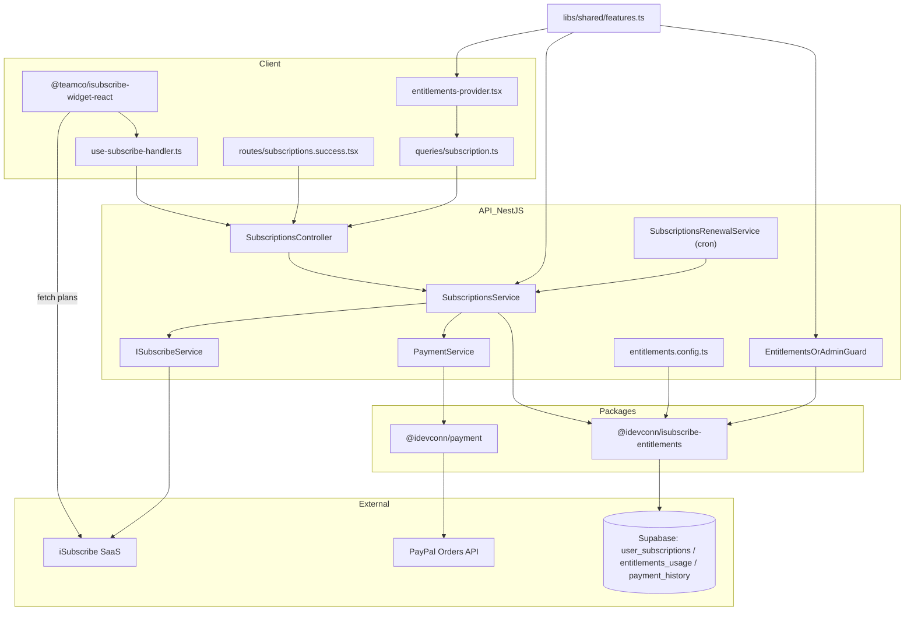
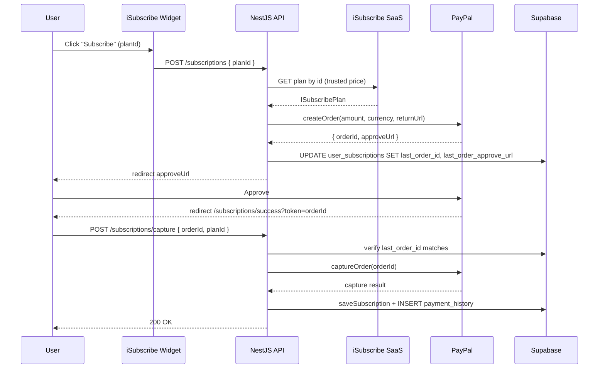

# Subscription Stack Port — L99 Senior-Architect Plan

> **Reference project:** [/Users/kudenv/pr/www/idevcon/warranty](/Users/kudenv/pr/www/idevcon/warranty)
> **Target:** a new (yet-to-be-defined) Nx workspace.
> **Scope confirmed:** Full stack — DB migrations + NestJS module + payment package + React provider + widget + i18n + docs + tests + CI.

---

## 1. Frame the decision

**Decision under review:** *How should we package the warranty subscription pattern so it can be dropped into a new Nx project (and, by extension, future projects)?*

**Constraints**
- Stack of reference: Nx 22 + NestJS 11 + Supabase + React 19 + Vite + TanStack Router + i18next.
- Three external dependencies do the heavy lifting and are already published to npm under iDevconn/Teamco scopes:
  - `@teamco/isubscribe-widget-react` (client widget that talks to iSubscribe SaaS)
  - `@idevconn/isubscribe-entitlements` (NestJS + React entitlements engine)
  - `@idevconn/payment` (payment provider strategy abstraction; PayPal active)
- Plans live in **iSubscribe SaaS** (single source of truth). No local `plans` table.
- Payments are **PayPal Orders v2** (one-shot), not PayPal Subscriptions API yet.
- Capture is **browser-initiated** (no webhook handler today). Renewal/dunning runs as a daily cron.
- Supabase persistence: `user_subscriptions`, `entitlements_usage`, `payment_history`.

**Unknowns / assumptions**
- Target project stack is assumed identical to warranty's (Nx + NestJS + Supabase + Vite + TanStack Router). Plan must call this out as a prerequisite.
- iSubscribe tenant credentials (`ISUBSCRIBE_API_KEY`, `VITE_TENANT_KEY`, plan IDs) must be provisioned per target project.
- Free-plan ID and the catalog of `FEATURE_SLUGS` will differ per target product.

---

## 2. End-to-end flow (what we are porting)

**Sequence — user buys a paid plan:**

---

## 3. Enumerate options

### Option A — Verbatim Fork & Strip ("Recipe Repo")
**Sketch.** Copy the warranty subscription stack file-for-file into the target Nx workspace (same folder layout, same module names, same DB migration content), then strip warranty-specific business logic (products, invoices, image search, bots) and replace `FEATURE_SLUGS` with the target product's gating slugs.

**Trade-offs**
- Performance / runtime: identical to warranty (proven in prod).
- Complexity: lowest; ~1 day to port mechanically, then 1–2 days to customize slugs and gated endpoints.
- Maintainability: ⚠ each future project diverges from warranty; bug fixes must be cherry-picked manually.
- Blast radius: contained — only touches the new project.
- Reversibility: trivial (delete folders).

**When it wins.** You need a working subscription system *this week* in exactly one new project and don't yet know if more projects will follow.

---

### Option B — Extract to Workspace Packages ("Library Mode")
**Sketch.** Promote the warranty wrappers (around the three published packages) into three new internal packages, then `pnpm add` them into the target project:
- `@yourorg/subscriptions-nest` — generic NestJS `SubscriptionsModule` parameterised by a config interface (`featureSlugs`, `paypalEnv`, `freePlanId`, plan-resolver mapper).
- `@yourorg/subscriptions-react` — generic React provider, hooks (`Feature`, `LockedFeature`, `useFeature`, `useLimit`), and unstyled UI building blocks (`PricingSection`, `BillingPanel`, `SuccessRoute`).
- `@yourorg/subscriptions-migrations` — versioned SQL migrations published as a tarball or copied via a CLI helper (Supabase migrations are not natively npm-distributable).

**Trade-offs**
- Performance: identical.
- Complexity: highest upfront (extraction + tests + per-package CI + semver discipline).
- Maintainability: ⭐ single source of truth; future projects upgrade by version bump.
- Blast radius: a buggy package release can break every consumer simultaneously.
- Reversibility: medium — once consumers depend on `@yourorg/*`, rolling back is painful.

**When it wins.** You have ≥3 active or planned projects sharing the exact same subscription contract and you can invest 1–2 weeks in extraction + a release pipeline.

---

### Option C — Nx Generator + Starter Template ("Scaffold-and-Customize")
**Sketch.** Build an Nx generator (`nx g @yourorg/subscriptions:setup`) that scaffolds the full warranty pattern into any Nx repo: writes NestJS module files, copies migrations into `supabase/migrations` with renumbered timestamps, scaffolds React provider + routes, patches `package.json`/`.env.example`, and appends a CI workflow snippet. Backed by an "examples" repo (essentially Option A) that the generator templates from.

**Trade-offs**
- Performance: identical at runtime.
- Complexity: medium — generator authoring is non-trivial but Nx's [`generateFiles`](https://nx.dev/recipes/generators/creating-files) helper is well-trodden.
- Maintainability: good — generator updates re-run against existing projects via a "migration"-style script; per-project divergence is expected and welcomed.
- Blast radius: zero on existing consumers (generators are pull-based, not push).
- Reversibility: high — generated files behave like normal source files.

**When it wins.** You expect to bootstrap multiple Nx repos over time, want each to be free to diverge, and can invest ~3 days in the generator (vs. ~1 day for Option A).

---

## 4. Recommendation

**Pick Option A (Verbatim Fork & Strip) for the first port, with file boundaries chosen so that Option C extraction is trivial later.**

**Justification (references §1 constraints):**
1. The three heavyweight dependencies (`@teamco/isubscribe-widget-react`, `@idevconn/isubscribe-entitlements`, `@idevconn/payment`) **already are the reusable library layer** — they're published, versioned, and consumed unchanged. The "thin layer" we are porting is mostly module wiring, Supabase migrations, and React route shells. Extracting *that* into an internal package (Option B) would add ceremony without reducing duplication meaningfully.
2. Speed-to-value: Option A delivers a working subscription system in days; Options B/C require 1–3 weeks of plumbing before the first feature ships.
3. iSubscribe SaaS already centralises the *plan catalog* (the part most prone to per-project drift). We don't need a code-level abstraction on top of an abstraction.
4. Folder discipline (mirror warranty's `apps/api/src/subscriptions/`, `apps/client/src/subscriptions/`, `libs/shared/src/features.ts`) keeps Option C migration cheap if a second project arrives — we can `generateFiles` straight from these paths.

**Strongest counter-argument & response.** *"If you ever port to a third project you'll regret not extracting now."* — accepted, but the warranty stack is still maturing (e.g. PayPal Subscriptions API migration is in design, dunning copy is app-specific, no webhook handler yet). Premature extraction would lock the API surface before it stabilises. Re-evaluate after the second consumer ships.

---

## 5. Reference inventory (what to copy in Option A)

> File paths below are absolute paths in the warranty repo. The new project should mirror the same relative paths.

### 5.1 Workspace prerequisites
- Nx 22.x with `@nx/js` plugin (see [warranty `nx.json`](/Users/kudenv/pr/www/idevcon/warranty/nx.json) and [`package.json`](/Users/kudenv/pr/www/idevcon/warranty/package.json)).
- NestJS 11 app at `apps/api`, Vite + React 19 + TanStack Router at `apps/client`.
- Supabase CLI + local stack, `auth.users` enabled (Google OAuth optional).
- Workspaces (npm/pnpm) wiring `apps/*` and `libs/*`.

### 5.2 npm dependencies to install
- **Root:**
  - `@teamco/isubscribe-widget-react@^2.3.0`
  - `@idevconn/isubscribe-entitlements@^0.3.7` (also installed in both apps)
- **API only:** `@idevconn/payment` (latest)
- **Already required by warranty stack (verify presence in target):** `@nestjs/schedule` (cron), `@nestjs/throttler`, `@supabase/supabase-js`, `class-validator`, `class-transformer`.

### 5.3 Backend files to copy (NestJS) — `apps/api/src/`

Source folder (copy as-is, then customise constants):
- [`subscriptions/`](/Users/kudenv/pr/www/idevcon/warranty/apps/api/src/subscriptions) — 14 source files + `__tests__/`:
  - `subscriptions.module.ts` — `EntitlementsModule.forRootAsync` wiring, `defaultPolicy: 'deny'`, `global: false`.
  - `subscriptions.controller.ts` — `POST /`, `POST /capture`, `GET /me`, `POST /cancel`, `POST /reactivate`, `GET /orders`.
  - `subscriptions.service.ts` — free-plan assignment, PayPal order creation, capture, cancel/reactivate.
  - `subscriptions-renewal.service.ts` — daily cron (03:00 UTC), dunning T-1 → T+14.
  - `isubscribe.service.ts` — cached catalog fetcher + upstream health.
  - `plan-resolver.ts` — maps `ISubscribePlan` → `PlanDefinition`.
  - `fallback-plan.ts` — bootstrap-resilient Starter plan when iSubscribe is down.
  - `entitlements.config.ts` — Supabase adapter (`cacheTtlMs: 0`).
  - `secure-user-context.resolver.ts` — **JWT-only** user-id resolver (never headers).
  - `entitlements-or-admin.guard.ts` — admin bypass wrapper.
  - `entitlements-exception.filter.ts` — PII strip in prod.
  - `feature-slug-validator.ts` — boot-time catalog drift check.
  - `dto.ts`, `isubscribe.types.ts`, `payment-history.types.ts`, `renewal-schedule.ts`.
- [`payment/payment.{module,service}.ts`](/Users/kudenv/pr/www/idevcon/warranty/apps/api/src/payment) — wraps `@idevconn/payment` with `PaypalStrategy`.
- Hook into [`auth/auth.service.ts`](/Users/kudenv/pr/www/idevcon/warranty/apps/api/src/auth/auth.service.ts) `register()` + `getMe()` to call `assignFreePlan()` (with rollback).
- Hook into `profile/profile.service.ts` `deleteAccount()` to block if `hasActivePaidSubscription()`.
- Register `SubscriptionsModule` and `PaymentModule` in `app.module.ts`. Enable `ScheduleModule.forRoot()` if not already present.

**Critical security invariants (do not edit out):**
- Re-fetch plan price from iSubscribe in `createPaidOrder` — never trust the widget's `effectivePrice`.
- Stash `last_order_id` on `user_subscriptions`; verify in `captureOrder` before capturing.
- Keep `defaultPolicy: 'deny'` and apply `@UseGuards(EntitlementsOrAdminGuard)` per controller (never as `APP_GUARD`).

### 5.4 Frontend files to copy (React) — `apps/client/src/`

- [`subscriptions/entitlements-provider.tsx`](/Users/kudenv/pr/www/idevcon/warranty/apps/client/src/subscriptions/entitlements-provider.tsx) + `index.ts` re-exports. Mount in `main.tsx`.
- [`queries/subscription.ts`](/Users/kudenv/pr/www/idevcon/warranty/apps/client/src/queries/subscription.ts), `queries/orders.ts` — React Query hooks calling `/subscriptions/*`.
- [`components/landing/landing-pricing.tsx`](/Users/kudenv/pr/www/idevcon/warranty/apps/client/src/components/landing/landing-pricing.tsx), `components/landing/use-subscribe-handler.ts` — `SubscriptionWidget` integration. **Strip warranty plan IDs** and re-add target product's plan IDs.
- `components/subscriptions/manage-plan-section.tsx`, `components/subscriptions/upstream-degraded-banner.tsx`.
- `components/profile/{current-subscription-card,cancel-subscription-modal,reactivate-subscription-button,orders-card}.tsx`.
- Routes (TanStack Router):
  - `routes/_dashboard/subscriptions.success.tsx`
  - `routes/_dashboard/subscriptions.cancel.tsx`
  - `routes/_dashboard/subscriptions.manage.tsx`
  - `routes/_dashboard/orders.tsx`
  - `routes/_dashboard/profile.tsx` (host card)
- Sidebar / nav gating helpers: `lib/sidebar-nav-items.ts`, `components/sidebar/nav-links.tsx`.
- i18n keys: extract `subscription.*`, `pricing.*`, `orders.*`, `billing.*` blocks from `apps/client/src/i18n/locales/{en,ru,he}.json` into the target project's locale files.

### 5.5 Shared lib — `libs/shared/src/`

- [`features.ts`](/Users/kudenv/pr/www/idevcon/warranty/libs/shared/src/features.ts) — **template only**. Replace `FEATURE_SLUGS` and `FEATURE_VALUES` with the target product's slugs. Slugs must match the iSubscribe dashboard exactly.
- `isubscribe-error-reason.ts`, `types.ts` (notification enum extensions), `index.ts` (re-exports).

### 5.6 Supabase migrations — `supabase/migrations/`

Copy these 8 files in order, **renumbering timestamps** to fit the target repo's migration history:

1. [`20260503000001_create_subscriptions.sql`](/Users/kudenv/pr/www/idevcon/warranty/supabase/migrations/20260503000001_create_subscriptions.sql) — `subscription_status` enum + `user_subscriptions` table + initial RLS.
2. [`20260513095424_extend_user_subscriptions_for_entitlements.sql`](/Users/kudenv/pr/www/idevcon/warranty/supabase/migrations/20260513095424_extend_user_subscriptions_for_entitlements.sql) — `provider` rename, `entitlements jsonb`, order stash columns, `entitlements_usage` table, `entitlements_increment_usage_capped` RPC.
3. [`20260513095605_harden_entitlements_rpc_and_rls.sql`](/Users/kudenv/pr/www/idevcon/warranty/supabase/migrations/20260513095605_harden_entitlements_rpc_and_rls.sql) — revoke RPC from anon/authenticated; RLS init-plan optimisation.
4. [`20260520120000_add_subscription_notification_types.sql`](/Users/kudenv/pr/www/idevcon/warranty/supabase/migrations/20260520120000_add_subscription_notification_types.sql) — notification enum values (depends on a pre-existing `notification_type` enum and `notifications` table; port those from warranty too if absent).
5. [`20260520130000_add_renewal_cadence_columns.sql`](/Users/kudenv/pr/www/idevcon/warranty/supabase/migrations/20260520130000_add_renewal_cadence_columns.sql) — `renewal_attempts`, `last_renewal_notification_at`, partial index.
6. [`20260520130100_add_subscription_expired_notification_type.sql`](/Users/kudenv/pr/www/idevcon/warranty/supabase/migrations/20260520130100_add_subscription_expired_notification_type.sql).
7. [`20260521000000_create_payment_history.sql`](/Users/kudenv/pr/www/idevcon/warranty/supabase/migrations/20260521000000_create_payment_history.sql) — `payment_kind` enum + `payment_history` ledger.

**Schema cheat-sheet (after all 7 applied):**
- `user_subscriptions(user_id, plan_id, status, provider, current_period_start, current_period_end, entitlements jsonb, last_order_id, last_order_approve_url, renewal_attempts, last_renewal_notification_at, tenant_id, …)`
- `entitlements_usage(user_id, tenant_id, metric, period_start, amount)`
- `payment_history(user_id, kind, provider, provider_order_id, plan_id, amount, currency, metadata, captured_at)`

### 5.7 Environment contract (port verbatim into target `.env.example`)

**API:**
| Variable | Notes |
|---|---|
| `ISUBSCRIBE_API_URL` | e.g. `https://isubscribe.me/api/v1/public/subscriptions/data` |
| `ISUBSCRIBE_API_KEY` | tenant key (same value as client `VITE_TENANT_KEY`) |
| `ISUBSCRIBE_ORIGIN` | must match iSubscribe dashboard allowed origins |
| `FREE_SUBSCRIPTION_PLAN_ID` | target product's Starter plan ID from iSubscribe |
| `PAYPAL_CLIENT_ID`, `PAYPAL_SECRET`, `PAYPAL_ENV` | `sandbox` or `live` |
| `APP_BASE_URL` | client URL for PayPal return/cancel redirects |

**Client:**
| Variable | Notes |
|---|---|
| `VITE_SUBSCRIBE_BASE_URL` | iSubscribe public API base |
| `VITE_TENANT_KEY` | client-safe tenant key for widget plan fetch |

Also propagate these through `docker-compose.yml` and CI secrets — see [`docs/runbooks/server-secrets-pipeline-sync.md`](/Users/kudenv/pr/www/idevcon/warranty/docs/runbooks/server-secrets-pipeline-sync.md).

### 5.8 Documentation to copy (then re-skin)

- [`docs/subscription_integration_architecture.md`](/Users/kudenv/pr/www/idevcon/warranty/docs/subscription_integration_architecture.md) — master spec, keep verbatim.
- `docs/runbooks/subscription-cancel-and-account-deletion.md`
- `docs/runbooks/renewal-cadence.md`
- `docs/runbooks/paypal-return-cancel-urls.md`
- `docs/runbooks/isubscribe-upstream-graceful-degradation.md`
- `docs/runbooks/isubscription-feature-slug-migration.md`
- `docs/runbooks/admin-bypasses-subscription-gates.md`
- `docs/superpowers/specs/2026-05-20-paypal-subscriptions-api-migration.md` — keep as a "future work" reference.

### 5.9 Tests to copy (gives ~85% coverage of the new module out-of-the-box)

All under `apps/api/src/subscriptions/__tests__/` and `apps/client/src/subscriptions/__tests__/`. Also copy:
- `apps/api/src/payment/__tests__/payment.service.unit.test.ts`
- `apps/client/e2e/subscriptions-free-tier.spec.ts` (Playwright spec — adapt selectors).

### 5.10 What is intentionally **NOT** ported (warranty-specific)

These exist in the warranty stack but must be re-decided for the target product:
- All `@RequireSubscription`-gated controllers (products, invoices, image-search, shares, bots) — re-implement against the target product's feature surface.
- Warranty-specific feature slugs (`up_to_5_products`, `ai_invoice_parsing`, `bot_assistant`, …) — replace with target slugs.
- Hardcoded plan IDs in `landing-pricing.tsx` (`dm0pgfjDgI70fgSrWe0h`, `OA9UD75W2XIUPTmlBofG`) — replace with target plan IDs.
- Warranty-specific dunning copy in `subscriptions-renewal.service.ts` — re-localise.
- `google_cse_quota` table — legacy/unrelated.

### 5.11 Known gaps to inherit (and decide whether to fix in the new project)

- **No PayPal webhook handler** — capture depends on the browser returning. Production-grade integration should add a webhook (`PAYPAL_WEBHOOK_ID` is documented in [the migration spec](/Users/kudenv/pr/www/idevcon/warranty/docs/superpowers/specs/2026-05-20-paypal-subscriptions-api-migration.md)).
- **No recurring billing** — renewal currently re-prompts the user via dunning notifications.
- **`entitlements_usage` table is pre-staged** but the client `consume()`/`usage()` flow is not wired end-to-end.

---

## 6. Execution outline (after approval)

1. **Pre-flight in target project:** confirm Nx/NestJS/Supabase/Vite/TanStack Router parity; provision iSubscribe tenant; create PayPal sandbox app.
2. **Backend port:** copy `apps/api/src/{subscriptions,payment}`, register modules, wire `assignFreePlan()` into auth.
3. **DB port:** copy + renumber the 7 migrations; verify against the target's `auth.users`/`notifications` schemas.
4. **Shared lib:** copy `libs/shared/src/features.ts` shell; populate target `FEATURE_SLUGS`/`FEATURE_VALUES`.
5. **Frontend port:** copy `apps/client/src/{subscriptions,queries/subscription,queries/orders,components/landing,components/subscriptions,components/profile}` + 5 routes; mount `EntitlementsProvider` in `main.tsx`.
6. **Env + CI:** add the 8 env vars to `.env.example`, `docker-compose.yml`, and CI secret-bake step.
7. **Docs:** copy `docs/subscription_integration_architecture.md` + 7 runbooks; re-skin product references.
8. **Tests:** copy unit tests + Playwright spec; run `nx run-many -t test` and `nx run client-e2e:e2e`.
9. **Smoke E2E:** sandbox checkout → capture → entitlement gates → cancel → reactivate.

---

## 7. Wait

**Approve this direction (Option A, with Option-C-friendly folder boundaries), or revisit options?**
I will not begin code changes until you explicitly approve. If you approve, please also share the **target project path** so I can tailor step 1 of the execution outline.
Subscription Stack Port